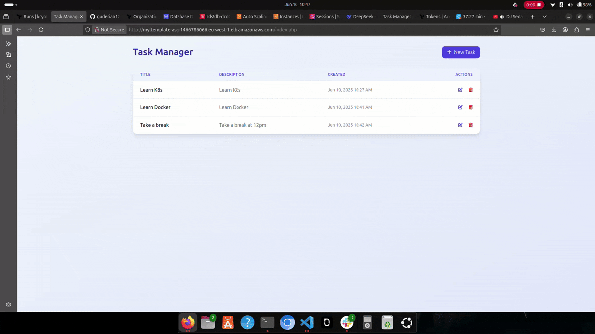
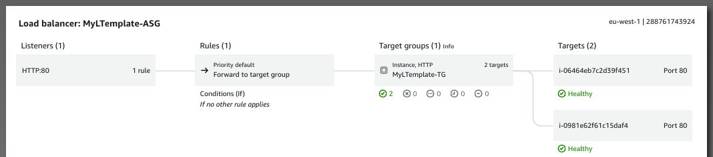
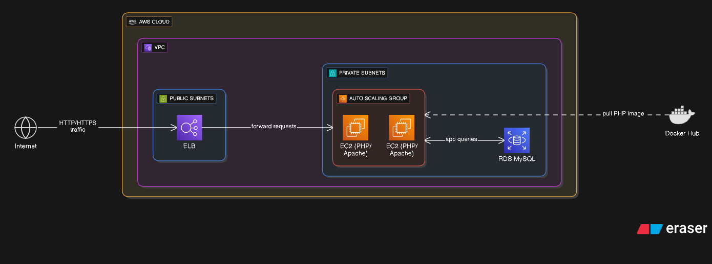

# LAMP Stack Deployment on AWS with Terraform Cloud CI/CD

## Table of Contents
1. [Project Overview](#project-overview)
2. [Key Features](#key-features)
3. [Prerequisites](#prerequisites)
4. [Local Development Setup](#local-development-setup)
   - [Terraform Cloud Configuration](#terraform-cloud-configuration)
   - [Local Machine Setup](#local-machine-setup)
5. [Architecture Components](#architecture-components)
6. [Deployment Workflows](#deployment-workflows)
   - [Terraform Cloud CI/CD](#terraform-cloud-cicd)
   - [Local Deployment](#local-deployment)
7. [Module Documentation](#module-documentation)
8. [Maintenance Guide](#maintenance-guide)
9. [Best Practices](#best-practices)
10. [Troubleshooting](#troubleshooting)
11. [Support](#support)

---



## Project Overview <a name="project-overview"></a>

This Terraform project automates the deployment of a highly available LAMP (Linux, Apache, MySQL, PHP) stack on AWS, with integrated CI/CD through Terraform Cloud. The infrastructure follows AWS Well-Architected Framework principles and features automatic deployments on code changes.

## 🔗 Live Deployment

The application is currently deployed and accessible at:  
[](http://myltemplate-asg-1466786066.eu-west-1.elb.amazonaws.com/index.php)

## Resource Map




## Key Features <a name="key-features"></a>

- **Terraform Cloud CI/CD**: Automatic plan and apply on code pushes
- **Highly Available Architecture**: Multi-AZ deployment
- **GitOps Workflow**: Infrastructure changes via Git repository
- **Remote State Management**: Secure state storage in Terraform Cloud
- **Collaboration Features**: Run history, notifications, and team management
- **Auto-scaling Web Tier**: Automatic scaling of web servers
- **Managed Database**: Amazon RDS MySQL with automated backups
- **Comprehensive Monitoring**: CloudWatch alarms and SNS notifications

## Prerequisites <a name="prerequisites"></a>

### Terraform Cloud Requirements
- Terraform Cloud account (free tier available)
- GitHub/GitLab/Bitbucket account for VCS integration
- Organization created in Terraform Cloud

### AWS Requirements
- AWS account with administrator permissions
- IAM user with programmatic access
- AWS CLI v2 installed

### Local Development Requirements
- Terraform v1.0+ installed
- Git client
- SSH key pair for EC2 access
- Text editor (VS Code recommended)

## Local Development Setup <a name="local-development-setup"></a>

### Terraform Cloud Configuration <a name="terraform-cloud-configuration"></a>

1. **Create a Terraform Cloud Workspace**
   - Log in to [Terraform Cloud](https://app.terraform.io)
   - Navigate to your organization
   - Click "New workspace"
   - Select "Version control workflow"
   - Connect your VCS provider (GitHub/GitLab/Bitbucket)
   - Choose your repository containing this project
   - Set workspace name (e.g., "prod-lamp-stack")

2. **Configure Workspace Variables**
   Add these variables in your Terraform Cloud workspace:

   | Variable | Category | Description |
   |----------|----------|-------------|
   | `AWS_ACCESS_KEY_ID` | Environment | Your AWS access key |
   | `AWS_SECRET_ACCESS_KEY` | Environment | Your AWS secret key |
   | `TF_VAR_db_password` | Terraform | Database password (mark as sensitive) |
   | `TF_VAR_ssh_ingress_cidr` | Terraform | Allowed SSH CIDR blocks |
   | `TF_VAR_region` | Terraform | AWS region (e.g., "us-east-1") |

3. **Configure Execution Settings**
   - Set execution mode to "Remote"
   - Enable "Auto apply" for automatic deployments (optional)
   - Configure VCS triggers to run on pull requests (recommended)

### Local Machine Setup <a name="local-machine-setup"></a>

1. **Clone the Repository**
   ```bash
   git clone https://github.com/guderian120/lamp_stack_infranstructure
   cd lamp_stack_infranstructure
   ```

2. **Configure Terraform Backend**
   Ensure your `backend.tf` is configured for Terraform Cloud:
   ```hcl
   terraform {
     backend "remote" {
       organization = "your-org-name"
       
       workspaces {
         name = "prod-lamp-stack"
       }
     }
   }
   ```

3. **Initialize Terraform**
   ```bash
   terraform init
   ```

4. **Configure Local Variables**
   Create a `terraform.tfvars` file with your configuration:
   ```hcl
   environment = "prod"
   region = "us-east-1"
   db_password = "your-secure-password"
   ssh_ingress_cidr_blocks = ["203.0.113.0/24"] # Restrict to your IP
   ```

## Architecture Components <a name="architecture-components"></a>

The solution consists of the following core components:

1. **Networking Layer**:
   - VPC with public and private subnets across multiple AZs
   - Internet Gateway and NAT Gateway for connectivity
   - Route tables for traffic management

2. **Compute Layer**:
   - Auto Scaling Group for web servers
   - Launch template with LAMP stack bootstrap
   - Application Load Balancer with health checks

3. **Data Layer**:
   - Amazon RDS MySQL instance
   - Automated backups and maintenance

4. **Security Layer**:
   - Security groups restricting traffic flow
   - IAM roles with least privilege

5. **Monitoring Layer**:
   - CloudWatch alarms for performance metrics
   - SNS notifications for critical events

## Deployment Workflows <a name="deployment-workflows"></a>

### Terraform Cloud CI/CD <a name="terraform-cloud-cicd"></a>

1. **Standard Workflow**
   - Push changes to your connected repository
   - Terraform Cloud detects VCS changes
   - Automatic `terraform plan` executes
   - Manual approval required (unless auto-apply enabled)
   - Changes are deployed to AWS

2. **Pull Request Workflow**
   - Plan runs automatically on pull requests
   - Team reviews plan output in Terraform Cloud
   - Approved changes merged to main branch
   - Automatic apply runs (if configured)

### Local Deployment <a name="local-deployment"></a>

1. **Development Workflow**
   ```bash
   # Create feature branch
   git checkout -b feature/new-config
   
   # Make changes and test locally
   terraform plan
   
   # Commit and push changes
   git add .
   git commit -m "Add new security group rules"
   git push origin feature/new-config
   ```

2. **Apply Changes**
   ```bash
   # Review changes
   terraform plan
   
   # Apply changes (if not using CI/CD)
   terraform apply
   ```

3. **Access the Application**
   ```bash
   terraform output -raw alb_dns_name
   ```

## Module Documentation <a name="module-documentation"></a>

The infrastructure is organized into reusable Terraform modules:

| Module | Description | Key Features |
|--------|-------------|--------------|
| `vpc` | Networking foundation | VPC, subnets, gateways, route tables |
| `security_groups` | Network security | ALB, web, and database security groups |
| `database` | Managed MySQL database | RDS instance, backups, private placement |
| `auto_scaling` | Web server fleet | Launch template, scaling policies, self-healing |
| `load_balancer` | Traffic distribution | ALB, target groups, health checks |
| `monitoring` | Observability | CloudWatch alarms, SNS notifications |

## Maintenance Guide <a name="maintenance-guide"></a>

### Scaling Operations
- **Vertical Scaling**: Adjust `instance_type` for RDS or EC2 instances
- **Horizontal Scaling**: Modify `min_size`, `max_size` in Auto Scaling Group

### Updates
1. **AMI Updates**:
   - Modify `ami_name_filter` in the auto scaling module
   - Create new launch template version

2. **Configuration Changes**:
   - Update user data scripts
   - Apply changes through Terraform Cloud CI/CD

### Backup and Recovery
- **Database Backups**: Managed by RDS with configurable retention
- **State Management**: Automatic state versioning in Terraform Cloud

### Destruction
To remove all resources through Terraform Cloud:
1. Queue destroy plan in workspace
2. Confirm destruction

## Best Practices <a name="best-practices"></a>

1. **Security**:
   - Use Terraform Cloud's sensitive variable handling
   - Implement Sentinel policies for governance
   - Enable VPC flow logs for traffic monitoring

2. **CI/CD Optimization**:
   - Separate workspaces for dev/stage/prod
   - Use cost estimation features
   - Implement pre-commit hooks for validation

3. **Cost Management**:
   - Use appropriate instance types
   - Implement auto-scaling policies
   - Clean up unused resources

## Troubleshooting <a name="troubleshooting"></a>

| Issue | Solution |
|-------|----------|
| Terraform Errors | Check the main.tf file, default profile is set to sandbox | Comment out the sandbox profile |
| Runs not triggering | Verify VCS connection in Terraform Cloud |
| Authentication errors | Verify AWS credentials in workspace variables |
| State conflicts | Use Terraform Cloud's state locking |
| Module errors | Verify module versions and compatibility |

## Support <a name="support"></a>

For additional assistance:
- [Terraform Cloud Documentation](https://www.terraform.io/docs/cloud)
- [AWS LAMP Stack Best Practices](https://docs.aws.amazon.com/)
- Repository Issues: https://github.com/guderian120/lamp_stack_infranstructure/issues

For production deployments, consider HashiCorp's paid support options for Terraform Cloud.