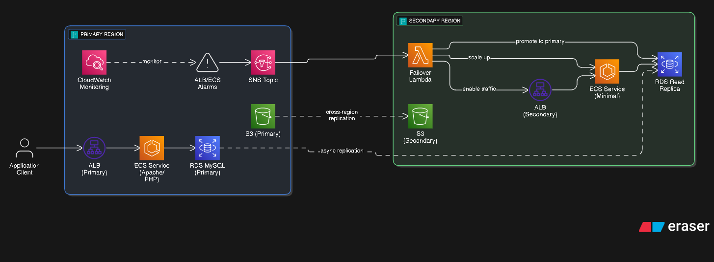

# 🛡️ Highly Available Pilot-Light LAMP Stack using AWS ECS

This project implements a **pilot-light disaster recovery (DR)** architecture for a LAMP stack (Linux, Apache, MySQL, PHP) using AWS ECS Fargate, RDS, CloudWatch, and Lambda. Infrastructure is provisioned using **Terraform** in modular form.

---

## 📚 Table of Contents

1. [Overview](#overview)  
2. [Architecture](#architecture)  
3. [Failover Mechanism](#failover-mechanism)  
4. [Directory Structure](#directory-structure)  
5. [Deployment Instructions](#deployment-instructions)  
6. [Monitoring & Alerting](#monitoring--alerting)  
7. [Media & Demo](#media--demo)  
8. [Future Improvements](#future-improvements)  
9. [License](#license)

---

## 🔍 Overview

This solution ensures high availability of a LAMP application across two regions by:

- Running full capacity resources in the **primary region**
- Keeping critical components (like RDS read replica and ECS services) in **standby in the secondary region**
- Automatically failing over upon detection of primary region degradation

---

## 🏗️ Architecture



### Primary Region Components:
- ECS Cluster with Apache + PHP containers
- Amazon RDS (MySQL)
- Application Load Balancer (ALB)
- CloudWatch metrics and alarms
- SNS for alarm notifications

### Secondary (Pilot-Light) Region:
- RDS Read Replica
- ECS Service in minimal capacity (cold or warm)
- Synchronized S3 buckets (if used)
- Lambda function to trigger failover

---

## 🔁 Failover Mechanism

Failover is **fully automated** using native AWS services:

1. **CloudWatch Alarms** monitor:
   - ECS CPU throttling
   - ALB unhealthy hosts

2. When an alarm state is triggered:
   - An **SNS topic** is notified
   - A **Lambda function** (defined in `modules/fail_over_resources`) is invoked
   - The Lambda function:
     - Upscales ECS services in the secondary region
     - Enables necessary load balancer or DNS exposure
     - Logs and notifies as needed

📂 Lambda code:  
`modules/fail_over_resources/failover_function/lambda_function.py`

📂 Alarms defined in:  
`modules/fail_over_resources/alarms.tf`

---

## 📁 Directory Structure

```

lampstack\_ecs\_deployment/
├── main.tf                    # Root module to wire up all submodules
├── terraform.tfvars           # Variables for customization
├── modules/
│   ├── ecs/                   # ECS task/service definitions
│   ├── database/              # RDS MySQL and replicas
│   ├── ecs\_alb/               # Application Load Balancer config
│   ├── fail\_over\_resources/   # CloudWatch alarms, SNS, Lambda
│   ├── monitoring/            # CloudWatch dashboards and logs
│   ├── kms/                   # KMS key management
│   ├── sns/                   # SNS topic setup
│   ├── security\_groups/       # Ingress/egress rules
│   └── vpc/                   # VPC and subnet configurations
├── media/                     # Diagrams and GIFs for reference
└── Readme.md                  # You're here!

````

---

## 🚀 Deployment Instructions

> Make sure AWS CLI and Terraform are configured.

### Step 1: Initialize Terraform
```bash
terraform init
````

### Step 2: Review Plan

```bash
terraform plan -out=myplan
```

### Step 3: Apply Deployment

```bash
terraform apply "myplan"
```

### Step 4: Verify Resources

* Check ECS services and tasks in the primary region
* Confirm RDS master and replica setup
* Visit your ALB endpoint to verify the LAMP app is running

---

## 📊 Monitoring & Alerting

> Defined in: `modules/monitoring` and `modules/fail_over_resources`

* **Dashboards**: View ECS CPU, memory, and service status
* **Alarms**:

  * `ECSCPUThrottlingAlarm`
  * `ALBUnhealthyHostAlarm`
* **SNS Topic**: Publishes alerts for Lambda failover execution
* **CloudWatch Logs**: Captures logs from ECS containers and Lambda

---

## 🎥 Media & Demo

| Visualization      | File                                                    |
| ------------------ | ------------------------------------------------------- |
| ECS Architecture   | `media/ecs_resource_map.png`                            |
| ALB Architecture   | `media/alb_resource_map.png`                            |
| Dashboard GIF      | `modules/monitoring/media/monitoring_dash.gif`          |
| Alert Trigger Demo | `modules/monitoring/media/monitoring_alarm_trigger.gif` |
| Live LAMP Demo     | `media/lamp_demo.gif`                                   |

---

## 🧠 Future Improvements

* Add automatic **failback** to primary region after recovery
* Integrate with **Slack or PagerDuty** for real-time alerting
* Improve test coverage for the failover Lambda
* Add CI/CD pipeline to deploy infrastructure and app separately

---

## 📄 License

Distributed under the MIT License. See `LICENSE` for details.

---

### 💬 Questions or Contributions?

Feel free to [open an issue](https://github.com/guderian120/lampstack_ecs_deployment/issues) or fork the project to contribute.

---

