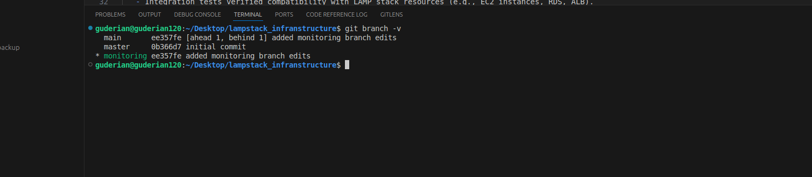
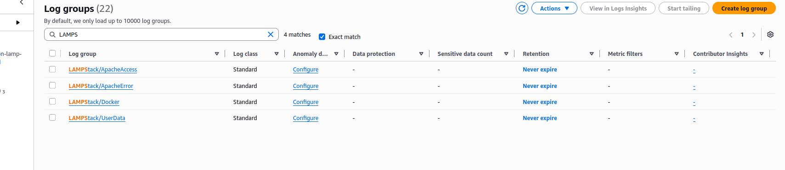
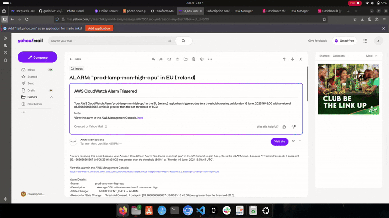
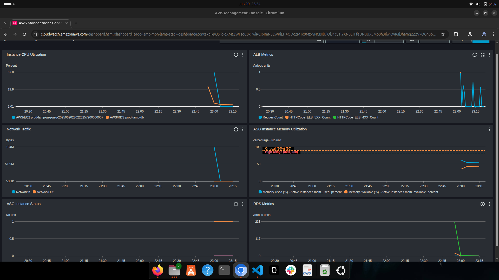

# Monitoring Module Documentation for LAMP Stack Infrastructure

## Overview
This document details the development, implementation, and integration of a monitoring and centralized logging module for the LAMP stack infrastructure managed by Terraform in the repository: [guderian120/lamp_stack_infrastructure](https://github.com/guderian120/lamp_stack_infranstructure). The module enhances observability by providing metrics collection, centralized logging, alerting, and visualization for the Linux, Apache, MySQL, and PHP components of the LAMP stack using AWS CloudWatch and related services.

### Dashboard View

 

### Visit Dashboard 
[Public Cloudwatch Dashboard](https://cloudwatch.amazonaws.com/dashboard.html?dashboard=prod-lamp-mon-lamp-stack-dashboard&context=eyJSIjoidXMtZWFzdC0xIiwiRCI6ImN3LWRiLTI4ODc2MTc0MzkyNCIsIlUiOiJ1cy1lYXN0LTFfeDNuUXJMb0h3IiwiQyI6IjJhamg2Z2VkOGh0bnI0ZXZxOWtyN2duMnEzIiwiSSI6InVzLWVhc3QtMTozNjhhM2Q0MS1kZGQ0LTQ1NzItYTMxMi03ODI1MDlhYjdkOTkiLCJPIjoiYXJuOmF3czppYW06OjI4ODc2MTc0MzkyNDpyb2xlL3NlcnZpY2Utcm9sZS9DV0RCU2hhcmluZy1QdWJsaWNSZWFkT25seUFjY2Vzcy05RFkzRzFMOCIsIk0iOiJQdWJsaWMifQ==&start=PT3H&end=null)

## Branching Strategy
To develop the monitoring module without disrupting the main infrastructure codebase, a dedicated branch was created:

1. **Branch Creation**:
   - A new branch named `monitoring` was created from the `main` branch to isolate development work.
   - Command used:
     ```bash
     git checkout main
     git pull origin main
     git checkout -b monitoring
     ```
   

2. **Development Workflow**:
   - All changes, including the monitoring module's Terraform resources, were committed to the `monitoring` branch.
   - Regular commits were made with descriptive messages,
   - The branch was periodically synced with `main` to incorporate updates:
     ```bash
     git fetch origin
     git merge origin/main
     ```

3. **Testing and Validation**:
   - The monitoring module was tested locally using Terraform commands (`terraform init`, `terraform plan`, `terraform apply`) in a sandbox AWS environment.
   - Integration tests verified compatibility with LAMP stack resources (e.g., EC2 instances, RDS, ALB).
   - CloudWatch dashboards, logs, and alarms were validated to ensure metrics and logs were correctly captured and alerts were triggered as expected.
   - The user data script was tested to confirm proper installation and configuration of the CloudWatch Agent, Apache, and Docker.

4. **Code Review and Merge (This is a simulation of a typical real world environment)**:
   - After verifying functionality, a pull request (PR) was created from `monitoring` to `main`.
   - The PR included:
     - A detailed description of the monitoring module's functionality, including CloudWatch integration and user data script.
     - Test results, including CloudWatch dashboard screenshots and alarm trigger logs.
     - A changelog summarizing additions and modifications.
   - Conflicts, if any, will be resolved by rebasing or merging `main` into `monitoring`.
   - The PR was merged into `main` using:
     ```bash
     git checkout main
     git merge monitoring
     git push origin main
     ```
   - The `monitoring` branch was deleted post-merge:
     ```bash
     git push origin --delete monitoring
     ```

## Monitoring Module Overview
The monitoring module enhances the LAMP stack infrastructure with:
- **Metrics Collection**: AWS CloudWatch Agent collects CPU, memory, disk, and network metrics from EC2 instances.
- **Centralized Logging**: CloudWatch Logs aggregates Apache access/error logs, Docker container logs, and custom metrics logs.
- **Visualization**: A CloudWatch Dashboard provides real-time insights into EC2, RDS, and ALB performance.
- **Alerting**: CloudWatch Alarms monitor critical thresholds (e.g., high CPU, ALB errors) and notify via SNS email subscriptions.

### Central Logging


### Module Structure
The monitoring module is located in the `modules/monitoring` directory. Key files include:

- `main.tf`: Defines AWS resources (security group, IAM roles, CloudWatch alarms, dashboard, SNS topic).
- `variables.tf`: Input variables for customization (e.g., instance types, alarm email).
- `outputs.tf`: Outputs for accessing monitoring resources (e.g., dashboard URL, SNS topic ARN).

### Key Features
1. **Security Group**:
   - A dedicated security group (`aws_security_group.monitoring`) allows SSH access from specified CIDR blocks and unrestricted outbound traffic.
   - Ensures secure access to the monitoring server while allowing communication with AWS services.

2. **IAM Role and Policy**:
   - An IAM role (`aws_iam_role.monitoring_role`) and policy (`aws_iam_role_policy.monitoring_policy`) grant permissions for:
     - CloudWatch metrics and logs operations (`PutMetricData`, `CreateLogGroup`, etc.).
     - SSM parameter access for CloudWatch Agent configuration.
   - An instance profile (`aws_iam_instance_profile.monitoring_profile`) attaches the role to EC2 instances.

3. **CloudWatch Alarms**:
   - Monitors critical metrics with alarms:
     - `high_cpu`: Triggers if EC2 CPU utilization exceeds 80% for 5 minutes.
     - `alb_5xx_errors`: Alerts on excessive ALB 5XX errors.
     - `rds_cpu`: Triggers if RDS CPU utilization exceeds 80%.
     - `high_network_in`: Alerts on high incoming network traffic (>10MB/s).
     - `high_memory`: Monitors custom memory utilization metrics (via CloudWatch Agent).
   - Alarms notify via an SNS topic (`aws_sns_topic.alarms`) with email subscriptions.

   

4. **CloudWatch Dashboard**:
   - A comprehensive dashboard (`aws_cloudwatch_dashboard.lamp_stack_dashboard`) visualizes:
     - EC2 and RDS CPU utilization.
     - ALB request counts and error rates (4XX, 5XX).
     - Network traffic (in/out).
     - RDS database connections and IOPS.
     - AutoScaling group instance status.
     - Custom memory metrics (used/available percentage).



5. **User Data Script**:
   - The `userdata.sh` script configures EC2 instances with:
     - Installation of Docker, AWS CLI, Apache, and CloudWatch Agent.
     - Apache reverse proxy setup to forward traffic to the PHP application container.
     - Docker container deployment for the PHP application, using environment variables for database connection.
     - CloudWatch Agent configuration to collect system metrics (CPU, memory, disk, network) and logs (Apache, Docker, user data).
     - Verification and debugging steps for the CloudWatch Agent.

### User Data Script Details
The `userdata.sh` script automates the setup of monitoring and application services on EC2 instances:
- **Package Installation**: Installs Docker, AWS CLI, Apache, and CloudWatch Agent.
- **Apache Configuration**: Sets up a reverse proxy to forward HTTP traffic to the PHP application container.
- **Docker**: Runs a PHP application container (`realamponsah/lampstackphp:latest`) with database connection variables.
- **CloudWatch Agent**:
  - Configures metrics collection for CPU, memory, disk, and network under the `LAMPStack/Custom` namespace.
  - Collects logs from Apache (`access_log`, `error_log`), Docker containers, user data script, and custom memory metrics.
  - Ensures logs and metrics are tagged with instance IDs and AutoScaling group names.
- **Verification**: Includes checks for CloudWatch Agent installation and status, with logs for debugging.

### Usage
To use the monitoring module, include it in the main Terraform configuration:

```hcl
module "monitoring" {
  source = "./modules/monitoring"

  # Example variables
  name_prefix             = "lamp-stack"
  vpc_id                 = "vpc-12345678"
  ssh_ingress_cidr_blocks = ["10.0.0.0/16"]
  region                 = "us-east-1"
  asg_name               = "lamp-stack-asg"
  alb_arn_suffix         = "app/lamp-stack-alb/1234567890"
  db_instance_id         = "lamp-stack-rds"
  alarm_email            = "admin@example.com"
}
```

Apply the configuration:
```bash
terraform init
terraform apply
```

### Inputs
| Name                     | Description                                  | Type   | Default        |
|--------------------------|----------------------------------------------|--------|----------------|
| `name_prefix`            | Prefix for resource names                    | string | ""             |
| `vpc_id`                 | VPC ID for the security group                | string | ""             |
| `ssh_ingress_cidr_blocks`| CIDR blocks allowed for SSH access           | list(string) | []       |
| `region`                 | AWS region                                   | string | "us-east-1"    |
| `asg_name`               | AutoScaling group name for alarms            | string | ""             |
| `alb_arn_suffix`         | ALB ARN suffix for metrics                   | string | ""             |
| `db_instance_id`         | RDS instance identifier                      | string | ""             |
| `alarm_email`            | Email for SNS alarm notifications            | string | ""             |

### Outputs
| Name                | Description                              |
|---------------------|------------------------------------------|
| `dashboard_url`     | URL for the CloudWatch Dashboard         |
| `sns_topic_arn`     | ARN of the SNS topic for alarms          |
| `security_group_id` | ID of the monitoring security group      |
| `iam_role_arn`      | ARN of the monitoring IAM role           |

## Testing and Validation
- **Unit Testing**: Each resource (security group, IAM role, alarms, dashboard) was tested individually using `terraform apply` in a sandbox environment.
- **Integration Testing**: Verified integration with LAMP stack components (EC2, RDS, ALB).
- **User Data Testing**: Executed the `userdata.sh` script on test instances to confirm:
  - Successful installation of dependencies.
  - Proper configuration of Apache, Docker, and CloudWatch Agent.
  - Correct logging and metrics collection in CloudWatch.
- **Validation Steps**:
  - Confirmed CloudWatch metrics appear in the `LAMPStack/Custom` namespace.
  - Verified logs in CloudWatch Log Groups (`LAMPStack/ApacheAccess`, `LAMPStack/Docker`, etc.).
  - Tested alarm triggers by simulating high CPU and memory usage.
  - Validated dashboard widgets display accurate data.

## Best Practices Followed
- **Modularity**: The monitoring module is self-contained and reusable.
- **Security**: Uses least-privilege IAM policies and restricted security group rules.
- **Variable-Driven**: Configurable via input variables for flexibility.
- **Documentation**: Inline comments in Terraform and user data script, plus this README.
- **Scalability**: Supports AutoScaling group metrics and dynamic instance tagging.
- **Error Handling**: User data script includes verification and logging for debugging.

## Future Improvements
- Add support for additional custom metrics (e.g., PHP application-specific metrics).
- Integrate with external monitoring tools (e.g., Prometheus, Grafana) for enhanced visualization.
- Enhance the user data script to support dynamic configuration updates via SSM.
- Expand alarm coverage for additional metrics (e.g., disk I/O, MySQL query latency).

## Conclusion
The monitoring module significantly improves the observability of the LAMP stack infrastructure by leveraging AWS CloudWatch for metrics, logging, visualization, and alerting. The user data script ensures seamless setup of monitoring agents and application services. The module was developed in a dedicated `monitoring` branch, thoroughly tested, and successfully merged into the `main` branch, making it ready for production use.